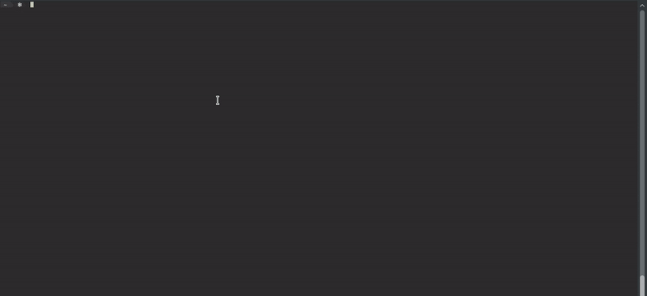
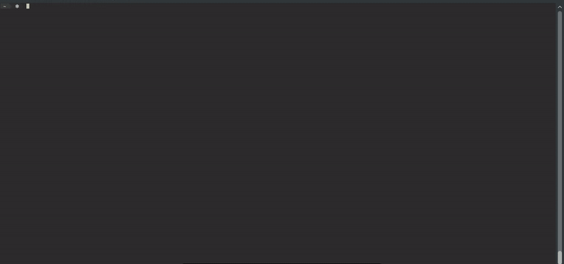

FootBuddy: A smart command line tool for Football fans
==================================================
All data is from [api.football-data.org](http://api.football-data.org/)






- Check upcoming/past games of your favourite team or any other team.
- Check league tables.
- Check league fixtures for any league.

If you have any suggestion/fix please feel free to open an issue or contribute :)

Install
-------

```
npm install -g footbuddy
```
 
 
 Todo
 -----
 
 Add more capabilities to the Bot:
 - Give the user the ability to change his favourite team.